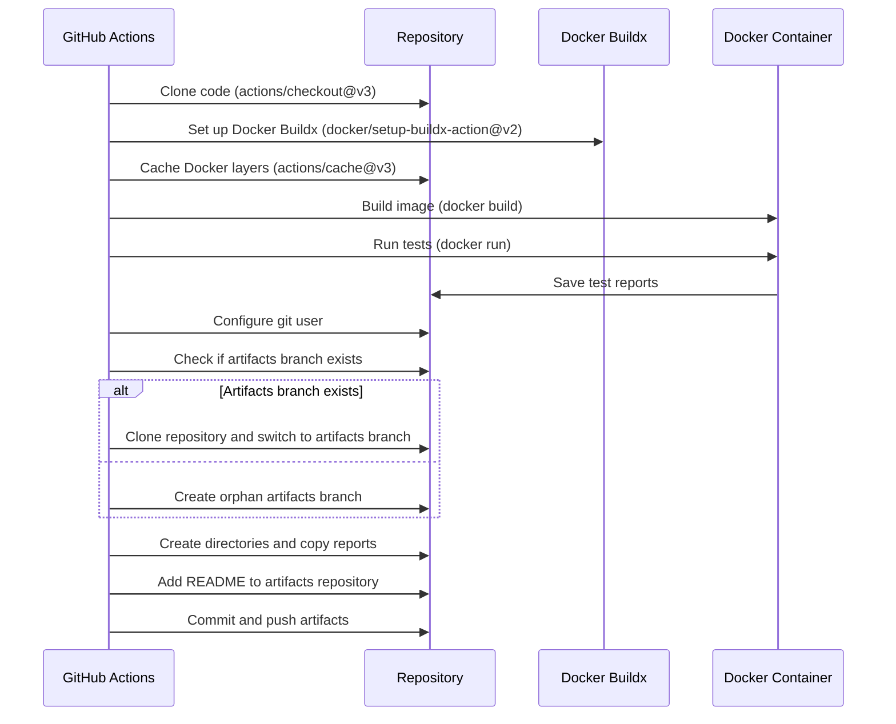

# Test with Artifacts
## Description

This GitHub Action builds a Docker image and runs tests. It also saves the test artifacts in a separate branch called `artifacts`.

## Inputs

- `gh-token` (required): The GitHub token needed to authenticate and perform operations on the repository.
- `artifacts-branch` (optional, default: 'artifacts'): The name of the branch where the artifacts will be saved.
- `dockerfile-path` (required, default: 'deployments/tests/Dockerfile.test'): The path to the Dockerfile used for testing.

## Environment Variables

The following environment variables are automatically set from the GitHub Actions context:

- `GH_TOKEN`: Required for GitHub authentication. This is a secret input and should be provided as a GitHub Actions secret.
- `COMMIT_ID`: The current commit ID.
- `BRANCH_NAME`: The current branch name.
- `REPO_NAME`: The current repository name.

## Steps

1. **Checkout code**: Uses the `actions/checkout@v3` action to checkout the repository code.
2. **Set up Docker Buildx**: Uses the `docker/setup-buildx-action@v2` action to set up Docker Buildx.
3. **Cache Docker layers**: Uses the `actions/cache@v3` action to cache Docker layers for faster builds.
4. **Build and run tests**: Builds the Docker image specified by the `dockerfile-path` input and runs the tests inside the Docker container.
5. **Save artifacts to branch**: Saves the test artifacts to the branch specified by the `artifacts-branch` input.

## Sequence Diagram



## Usage Example

```
name: CI

on:
  push:
    branches:
      - main
      - development
      - staging
  pull_request:
    branches:
      - main
      - development
      - staging

jobs:
  build-and-test:
    runs-on: ubuntu-latest
    steps:
      - name: Checkout code
        uses: actions/checkout@v3
      
      - name: Run Build and Test Action
        uses: ronihdzz/test-action@main
        with:
          gh-token: ${{ secrets.GH_TOKEN }}
          artifacts-branch: 'artifacts' # optional, defaults to 'artifacts'
          dockerfile-path: 'deployments/tests/Dockerfile.test' # optional, defaults to 'deployments/tests/Dockerfile.test'
```

## Notes

* Ensure you add `GH_TOKEN` as a secret in your GitHub repository settings.
* The `artifacts-branch` input can be customized to specify the branch where artifacts will be saved. If not provided, it defaults to `artifacts`.
* The dockerfile-path input can be customized to specify the path to the Dockerfile used for testing. If not provided, it defaults to `deployments/tests/Dockerfile.test`.