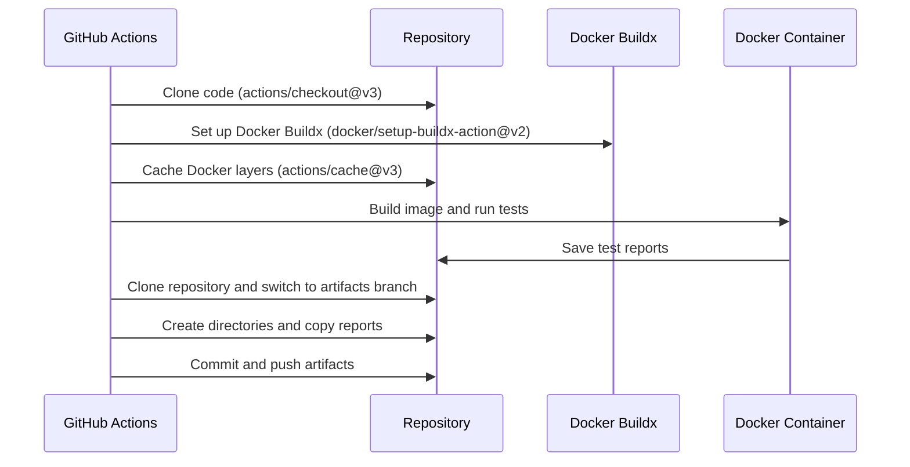

# Test GitHub Action

## Description

This GitHub Action builds a Docker image and runs tests. It also saves the test artifacts in a separate branch called `artifacts`.

## Inputs

- `gh-token` (required): The GitHub token needed to authenticate and perform operations on the repository.

## Environment Variables

- `GH_TOKEN`: Required for GitHub authentication. This is a secret input and should be provided as a GitHub Actions secret.
- `COMMIT_ID`: The current commit ID. This value is automatically obtained from the GitHub Actions context.
- `BRANCH_NAME`: The current branch name. This value is automatically obtained from the GitHub Actions context.
- `REPO_NAME`: The current repository name. This value is automatically obtained from the GitHub Actions context.

## Steps

1. **Checkout code**: Clone the repository using `actions/checkout@v3`.
2. **Set up Docker Buildx**: Configure Docker Buildx using `docker/setup-buildx-action@v2`.
3. **Cache Docker layers**: Use `actions/cache@v3` to cache Docker layers and speed up future builds.
4. **Build and run tests**:
   - Build a Docker image using the Dockerfile located at `deployments/tests/Dockerfile.test`.
   - Run the built Docker image, mounting the reports directory to store test results.
5. **Save artifacts to the artifacts branch**:
   - Configure git credentials.
   - Clone the repository and switch to the `artifacts` branch.
   - Create directories to store artifacts based on the commit ID and branch.
   - Copy the test reports to the appropriate directories.
   - Commit and push the artifacts to the `artifacts` branch.

## Sequence Diagram




## Usage Example


```
name: CI

on:
  push:
    branches:
      - main
      - development
      - staging
  pull_request:
    branches:
      - main
      - development
      - staging

jobs:
  build-and-test:
    runs-on: ubuntu-latest
    steps:
      - name: Checkout code
        uses: actions/checkout@v3
      
      - name: Run Build and Test Action
        uses: ronihdzz/test-action@main
        with:
          gh-token: ${{ secrets.GH_TOKEN }}
```

## Notes

* Ensure you add `GH_TOKEN` as a secret in your GitHub repository settings.
* This workflow uses Docker to build and run tests, so Docker must be installed and configured on the GitHub Actions runner.
